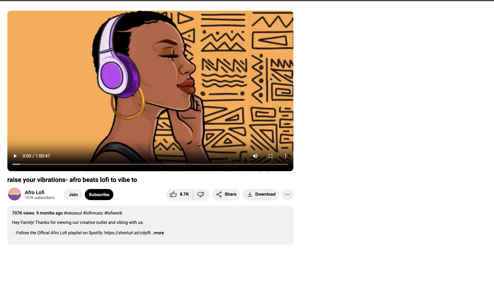

# YouTube Video Component - Afro Lofi Vibes

This project is a recreation of a YouTube video component featuring an Afro Lofi music video. The design and layout were created using HTML and CSS, with a focus on replicating YouTube's video card style. This project includes interactive buttons, video playback, and creator information. Was fun creating this as I tried to get as close as I could with the styling!

## Features

- Video player that replicates YouTube’s player with basic playback controls.
- Uses external Google Fonts and Material Icons for a modern UI look.
- Responsive layout optimized for different screen sizes.

## Technologies Used

- **HTML5**: Structure and layout of the page.
- **CSS3**: Styling the page, including responsive design and button hover effects.
- **Google Fonts**: To incorporate the `Roboto` font for a sleek modern look.
- **Material Icons**: Google’s Material Symbols were used for the like, dislike, share, and other engagement buttons.

## Future Improvements

- **JavaScript Interactivity**: Add functionality like real-time like/dislike counters and share links.
- **API Integration**: Replace static data (e.g., views and subscriber count) with real-time data fetched from YouTube's API.
